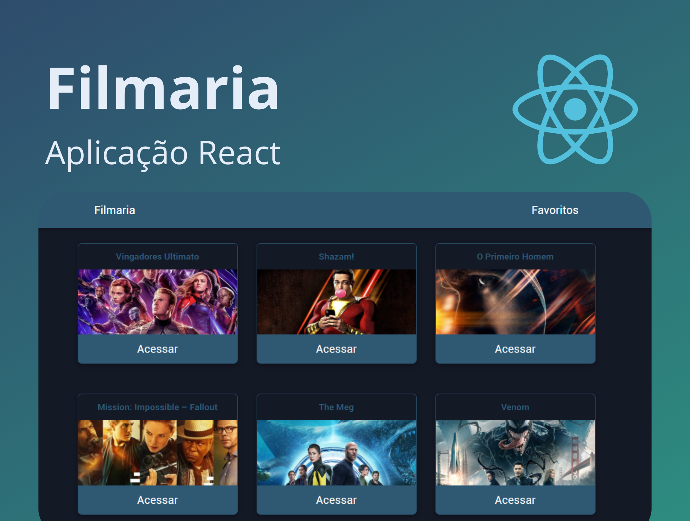

<!-- 

  

 -->

  

     

<h1 align="center">
    
</h1>

https://user-images.githubusercontent.com/50966170/128649522-aba6ac3e-813b-4330-9f89-438f59e83118.mp4

 

## 🧪 Tecnologias

Esse projeto foi desenvolvido com as seguintes tecnologias:

- ReactJS
- Styled-Components
- JavaScript
- React-Toastify
- Axios

## 💻 Projeto

Filmaria foi um projeto desenvolvido no curso de ReactJS do básico ao avançado na prática, nesta aplicação utilizei Styled Components como principal forma de estilização, react-router-dom para criar um navegação dinâmica entre as páginas e utilizei o localStorage do navegador para armazenar informações sobre os filmes que o usuário escolheu como favorito.

## 🔖 Deploy

Você pode visualizar o projeto aovivo através do link abaixo:

- [Website](https://filmaria-angelo.netlify.app/) 

## 📝 License

Esse projeto está sob a licença MIT. Veja o arquivo [LICENSE](LICENSE.md) para mais detalhes.

---

